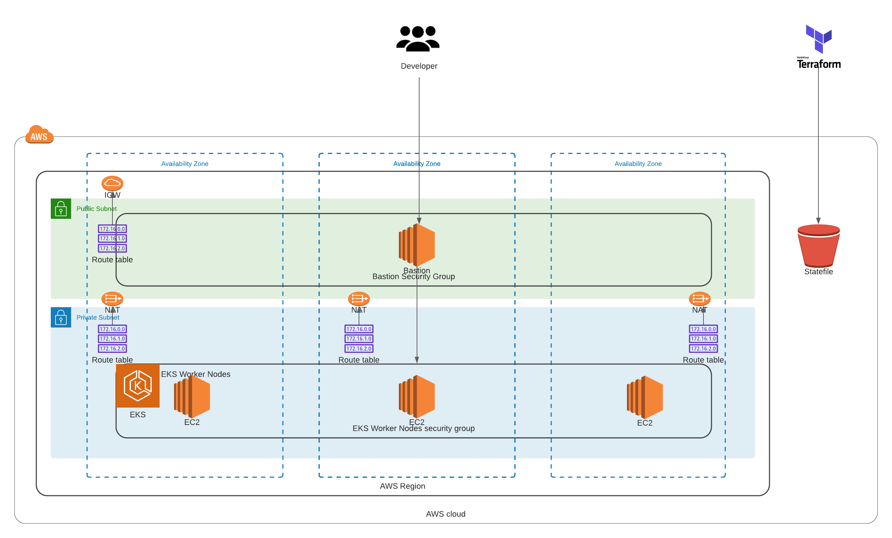

## Summary

This repo will create a create your custom EKS environment.

## Basic Architecture



## Built with:

## Built with:

* Terraform (v1.1.5)
* AWS_ACCESS_KEYS and AWS_SECRET_ACCESS_KEYS are set as environment variables (link: https://docs.aws.amazon.com/cli/latest/userguide/cli-configure-envvars.html).
* Note that this repo uses AWS profile for additional security (link: https://www.wisdomgeek.com/development/aws/configure-multiple-accounts-in-aws-cli/), the profile for this repo depends on what you're using for your personal account.

### Step by Step deployment
* **Step 1: Clone the Repo**. This command will clone the repo and will change directory the recently cloned repo
```shell script
$ git clone https://github.com/antonio-rufo/tf-jayaprakash6699.git
```

* **Step 2: Create a S3 bucket for remote state storage.** Update the `terraform.tfvars` file with your account ID and region and environment
```shell script
$ cd tf-jayaprakash6699
$ cd statebucket
$ vi terraform.tfvars
```
Create the resources:
```shell script
$ terraform init
$ terraform plan
$ terraform apply --auto-approve
```
Take note of the output for `state_bucket_id`. You'll need to update the `main.tf` on each layer with it. It is not yet possible to have the state bucket values interpolated.  


* **Step 3: Create your base layer.** Update the `terraform.tfvars` file with your account ID, region, and aws profile. Then fill up all required variables. Then update `main.tf` with the **state_bucket_id** created in step 2 (line 26) as well as the **region** (line 28) and aws profile (line 30).
```shell script
$ cd ../environment/000base
$ vi terraform.tfvars
$ vi main.tf
```
Create the resources:
```shell script
$ terraform init
$ terraform plan
$ terraform apply --auto-approve
```

* **Step 4: Create your compute layer.** Update the `terraform.tfvars` file with your account ID, region, and aws profile. Then fill up all required variables. Then update `main.tf` with the **state_bucket_id** created in step 2 (line 28 and 43) as well as the **region** (line 30 and 45) and aws profile (line 32 and 47).
```shell script
$ cd ../100compute
$ vi terraform.tfvars
$ vi main.tf
```
Create the resources:
```shell script
$ terraform init
$ terraform plan
$ terraform apply --auto-approve
```

* **Step 4: Login to your bastion host.** Connect to the EKS cluster.
```shell script
aws eks update-kubeconfig --name <cluster_name> --region <region>
kubectl get nodes
```
